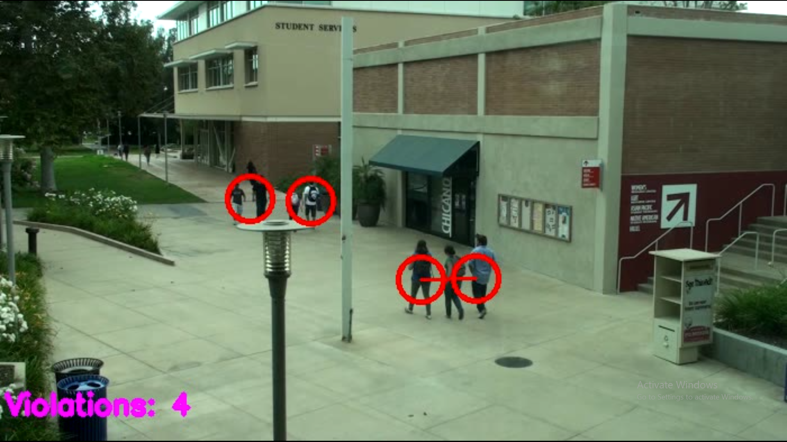
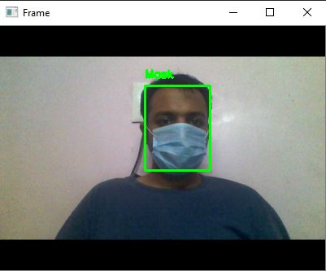
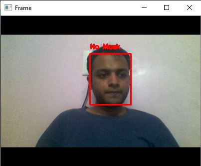
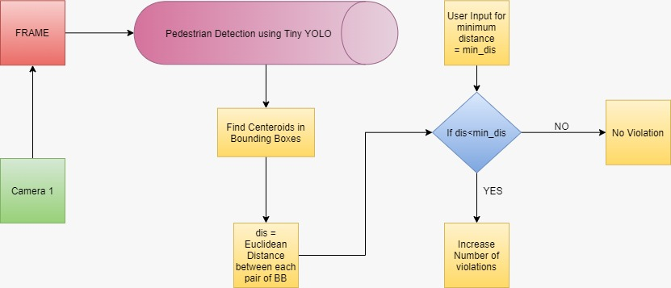
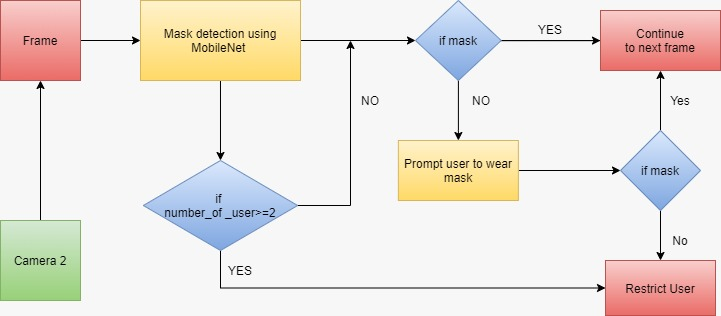

## Cloud Deployable AI Assisted Covid Surveillance Software

We used a 2 camera setup to detect facial mask and social distancing voilations.
Facial mask detection using transfer learning and pretrained ResNet model on CAM 1
and to detect six feet distance voilations using Tiny Yolo on feed of CAM 2.

## PREREQUISITES:
- Python
- Windows

## REQUIREMENTS:
- Keras
- Tensorflow 
- Tensorflow GPU
- Numpy
- Pandas
- Scikit-image
- opencv


## How to Use:

For using facial mask detection:
```
python detect_mask.py
```
For calculating six feet voilations:
```
python distance_detection.py -i input_video.mp4 -o output.avi -d=0
```


## RESULTS:
**Distance Detection Output**
  

**Mask Detection Output**

 


## MODEL ARCHITECTURE:

**Flow Diagram of Distance Calculation Model**


**Flow Diagram of Mask Detection Model**

